# Pre-installation

- Zephyr version: 3.5 or later [zephyr_installation_guide](https://docs.zephyrproject.org/latest/develop/getting_started/index.html)
- CMake Version: 3.27.4
- OS: Windows 11 23H2 or later
- Vivado version: 2023.2 [vivado_installation](https://www.xilinx.com/support/download/index.html/content/xilinx/en/downloadNav/vivado-design-tools.html)
- Board: STM32 NUCLEO-F091RC, STM32 NUCLEO-F030R8 or equivalent
- FPGA: Basys3
- Buttons: 7 physical buttons

# Installation

## Hardware

### Conneting

To connect the STM32, FPGA and buttons a shield had been made. The layout of this shield has been drawn in the image below. The connector has been made in such a way that it is difficult to connect it incorrectly.

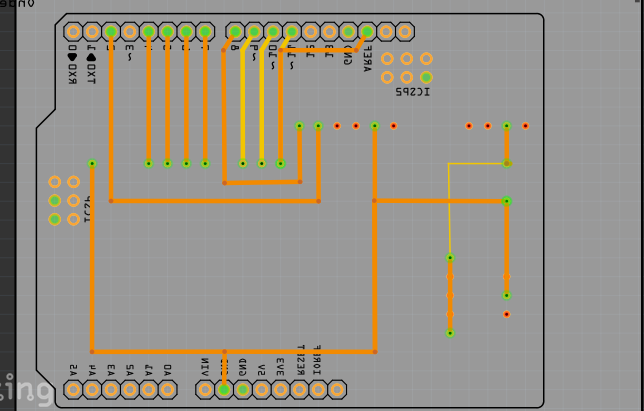

### Button colours

The buttons are connected to specific coloured lines to make troubleshooting simpler.
- black    = ground
- red      = down garden
- blue     = left garden
- white    = up garden
- yellow   = right garden
- green    = right shop
- pink     = confirm shop
- orange   = left shop


## Electrical diagram and Pin-Out

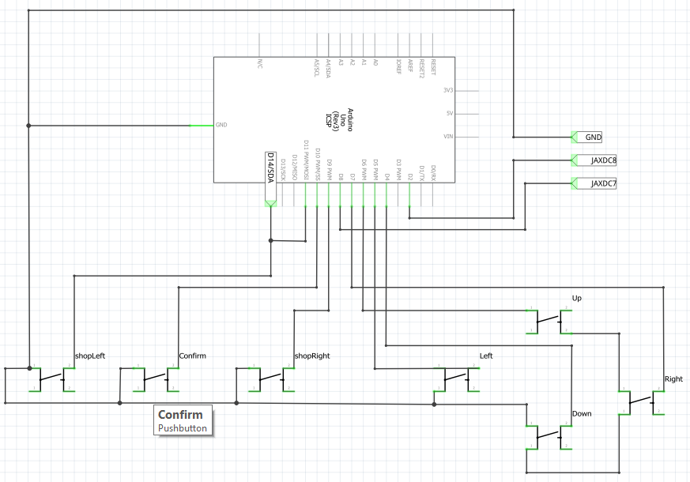
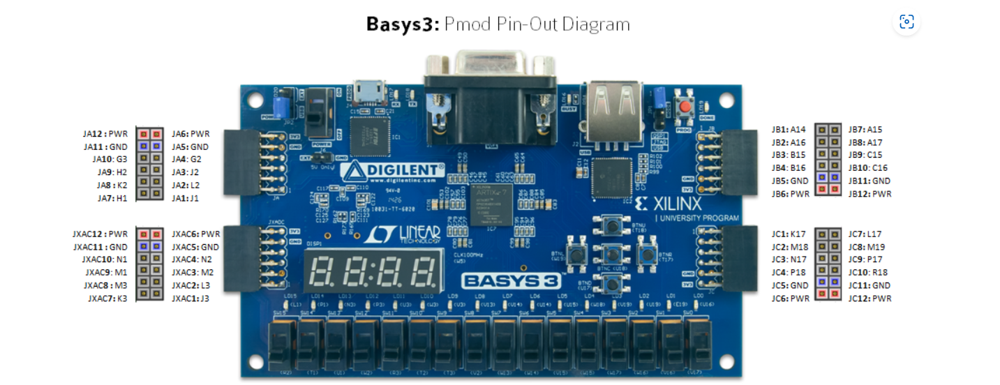

## STM32

If you are using an STM NUCLEO-F030R8 one can simply follow the [zephyr tutorial](https://docs.zephyrproject.org/latest/develop/getting_started/index.html#build-the-blinky-sample) but instead of `samples\basic\blinky` it should direct to the folder containing the cmake and build files for this project.

### STM32 uploading

To upload a game onto your STM NUCLEO-F091RC OR NUCLEO-32F030R8, follow these steps:

1. Open your command prompt and enter the following command (replace the directory with the correct path to your project):
`cd c:/path`

2. Build your project. The command will depend on the microcontroller you are using:
For STM NUCLEO-F030R8:
`west build -b nucleo_f030r8 -p always -d build`
For STM NUCLEO-F091RC:
`west build -b nucleo_f091rc -p always -d build`

3. Finish the upload with the following command:
`west build`
   
## FPGA

To install the game on the FPGA first open the project in Vivado. 
1. If there is no bitstream generated generate one. The option to generate a bitscream can be found in 'PROGRAM AND DEBUG'. 
2. A few popups will appear Select OK on everything and wait.
3. Now you will either receive an error message or a popup that the bitstream has been generated. If the latter was the case continue to 4. Otherwise, check the error and continue to the topic: errors FPGA
4. In the hardware manager press on 'Open target' if no hardware target is open and press Auto Connect.
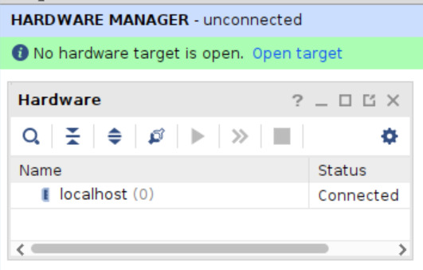

5. After connecting to the FPGA press 'Program device' and then 'OK'. Now the device should get programmed.
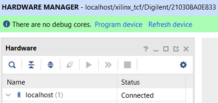

### Errors FPGA

It is possible that when generating a bitstream results in an error. There are many options however most are the following:
1. "error: no error" This error may be ignored and you can continue as normal.
2. "Constraint error" It is likely that you have accidentally renamed a variable in the main or constraints file or forgotten to add it to the constraints file.
3. "Timing constraints error" You might have added timing constraints to which the device was not built. One should either try to fix these by delving into the code or remove the timing constraints from the constraints file.
4. "Mismatched size ..." Match the size of the mismatched variables. Make sure to modify the correct variable since that has affect on how the program runs and how many variables you might have to change.

### Block Diagram

The following block diagrams are not UML compiant however they do depict the working of the FPGA clearly so that one can understand how the program works in general.

- Top view GPU 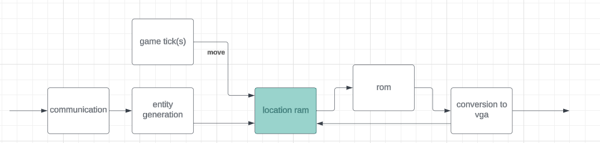
- Middle view GPU 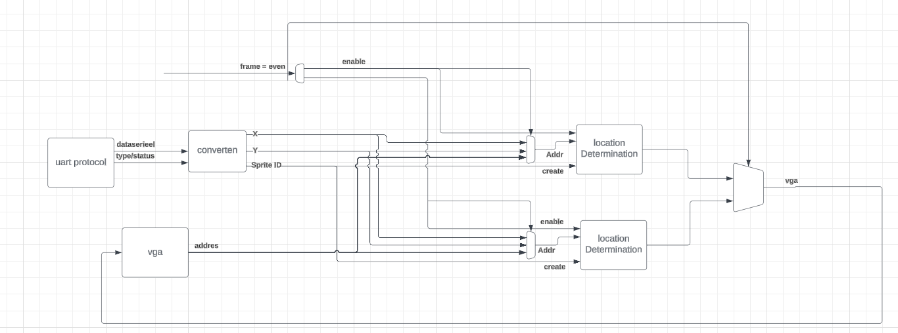

### Programming the FPGA with power off abilities 

To be able to turn off the FPGA and disconnect it from its power without losing the program if has to first be programmed using the previous method except a module has to be added to add the ability for the FPGA to program itself. The JP1 connector must also be put in QSPI mode (on the top 2 pins) for this to work properly. When this bitstream has been put on the device one can press the big red button and now the program is programmed into the non-voletile memory of the FPGA.

For more information on how the FPGA can be installed with the ability to be powered off without losing the program [this](https://www.youtube.com/watch?v=eVMBHD2S6v4) youtube video can help.

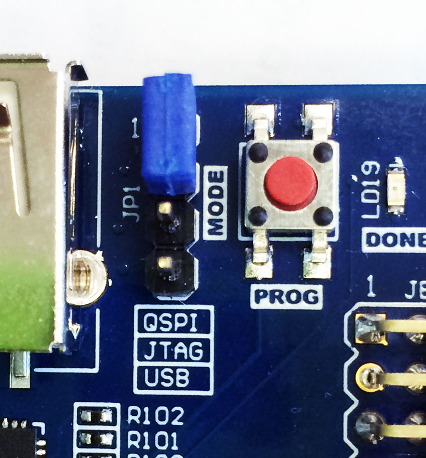

## Controls

There are 7 buttons for the user to interact with. There are 2 buttons to navigate the shop menu and 4 to navigate around the field. 
There also is a button to confirm a purchase which places the selected plant from the menu on the location of the selector on the field.


# Modifying the program

## Game balancing

To change the game logic one can chang ethe amount of seconds one action takes. The image below depicts our demo game. This is made in a way that we believe is fun however a user still might want to change it. To do so one simply changes the numbers corresponding to the thing they want to change. So if the amount of robots per seconds should be increased the robotrate has to be decreased.

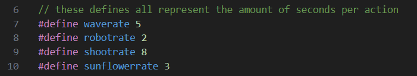

## Structure c en h files
- main.h            contains all structs relevant for bullets, plants, robots.
- main.c            contains send_out list, trigger of gameUpdate, pause screen, cheat activate, hardware setups (buttons and uart).
- menu.c            containts deadscreen().
- updateHandler.c   contains all functions relevant during gameplay (updating plants, robots and bullets).
- uart.c            contains the function for reading uart and sending out bullets, robots and plants to the FPGA.
- mainGame.c        contains a few initializers.
- bullet.c          contains damage handling for the bullets and the pineapple.

## Update Sprites

Updating the sprites is done by replacing the .coe files in the vivado project. 
It is important to note that a sprite must be **80x80** pixels. Furthermore, the background colour of the sprite must be 0x0A3 to filter it out and properly show the background.

### How to convert png's to .coe files

1. locate the file you want to convert
2. download [matlab](https://www.mathworks.com/products/matlab.html)
3. open matlab
4. download the converter (img2coe.m)
5. Replace the *[path/to/file.png]* with the actual path to the file you want to convert.

### Replacing the sprite

1. Open the project and locate the sprite you want to replace.
2. Rightclick on the image you want to replace and give the path to the new sprite.


3. In the ROM that matches the sprite you want to replace change the path to the path of your new sprite.
These ROM blocks can be found in main->vROM.


4. After replacing the path let it generate a new Block Memory.
5. When you're sure you've made all changes you can generate a new bitstream and program the device.

## Update text

Most text used in the game can be changed from main->textComp. Here one should look for the text they want changed.
The text is saved directly in the portmap for simplicity. When changing the text one should be careful and make sure they too change the 'textLength' to the length of the total amount of characters in 'displayText'. 

After changing the length of 'displayText' and 'textLength' it might be necessary to change the horizontal position of the text. This can be done in 'position'.

## Change sound

Changing the sound of the game or the music is done using the files `Sound.vhd` and `SoundController.vhd`.

### Change frequencies belonging to IDs

To save space only a few frequencies have been placed in the SoundController. There are also no notes. So there is no C#, Eb or anything like that. If you want to utilise those you have to add them yourself. The notes **F4 to F5** do exist.There also is one specific ID for a wrong note. This gets played when a player gets damaged.

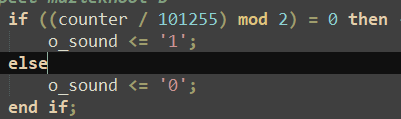

The number `101255` in the image above is gathered from the formula: ```((({clock Frequency})/2/[{frequency}) % 2```.

### Change music

The music can be changed from `Sound.vhd`. The noteID of the note requested 
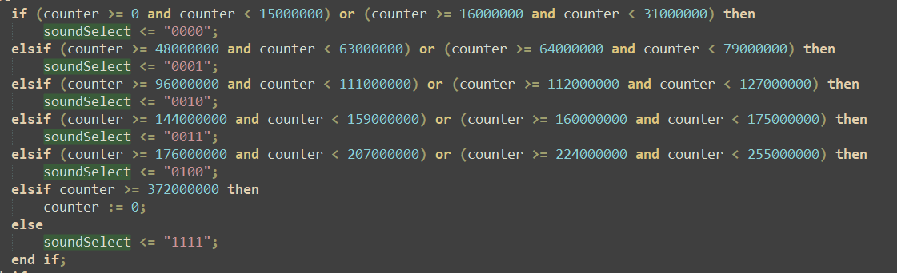

## Gameplay

The shop is controlled by the 3 buttons on the left. left button makes the selector(yellow square on the upper gray row) go left the middle one confirms a purchase. the right moves the shop selector to the right.

the four buttons on the right are for the screen selector up, down, left, right. moves the yellow square in the green field.

Evil robots will come from the right side. they will move to the left. If 4 four robots reach the left side you die and have to restart.

By placing plants you defend the against the robots. If you ever feel like you misplaced a plant you can just place an other plant on top of the old plant rewriting that spot. The objective is to survive as many waves of robots as possible.

- **Sunflower:** 
    - generates money every few secconds.

- **Shooter:** 
    - shoots a bullet every few secconds.

- **Crazy pear:** 
    - A heavy pear giving its life for the cause. very tanky. has no action.

- **Exploding pineapple:** 
    - When an evil robot is about to hit the pineapple it explodes, instantly killing every robot in a large range(one square higher & lower and two squares to the front) as shown below XX OXX_ XX

### Example strategy

place shooters on the second(seen from the left) row on the lines where robots are aproaching. when the first three waves are beaten you can start placing sunflowers in the first row(seen from the left) to generate a steady flow of income. This should keep you save for a few more waves now you can start. The crazy pear is best to use on the right side of the screen. Keep in mind that placing plants on the right border can be risky as those plants will get attaked fast(and probably die fast as well) but will also shield the plants on other lines from direct danger.
